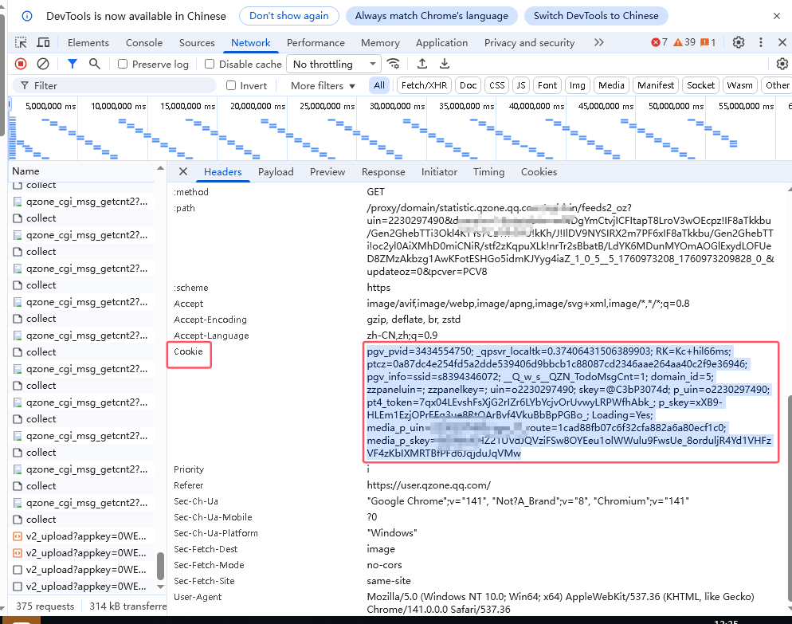

# Timestamptollm

AstrBot 插件
这是一个让信息获取时加入时间戳，让llm更好理解时间变化插件。不会出现昨晚说的话llm还觉得是刚才了！
其中获取时间戳部分或许也可以用于节日祝福等功能。
# 注意！
Astrbot的session_plugin_manager.py会过滤处理器导致这个插件无法运行，请将红框内内容注释掉或备份此文件后删除，并将
return filtered_handlers
改为return handlers

修改后的文件内容

如果您有能力改进这个插件或有更好想法，请自由使用！
# 支持
Astrbot[帮助文档](https://astrbot.app)

